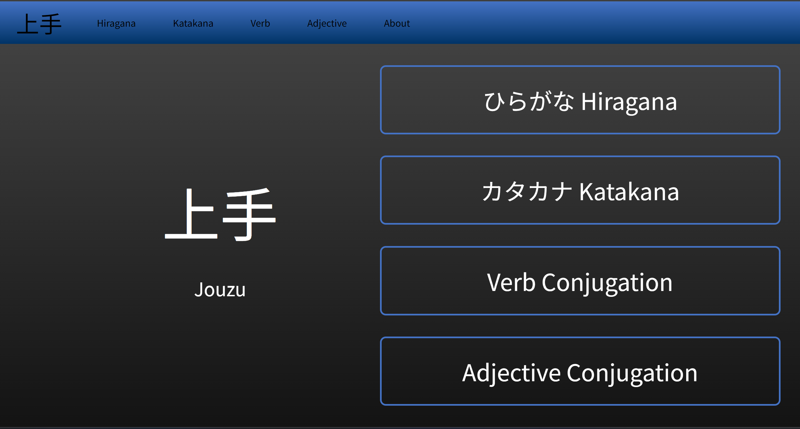
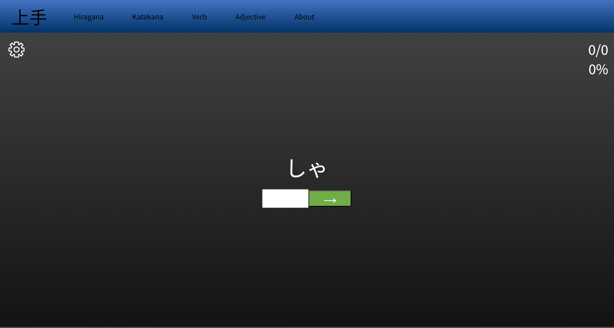
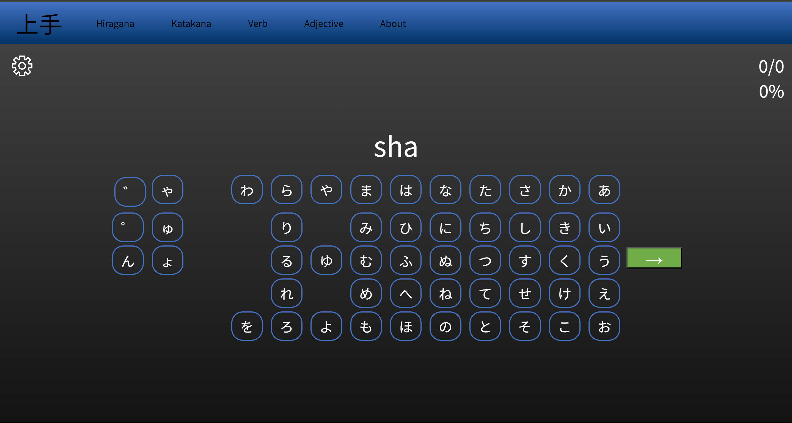
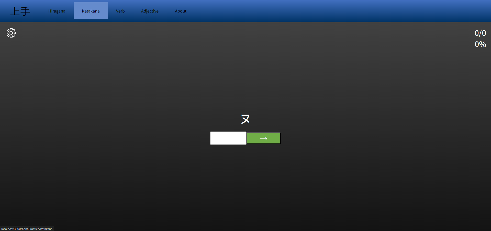
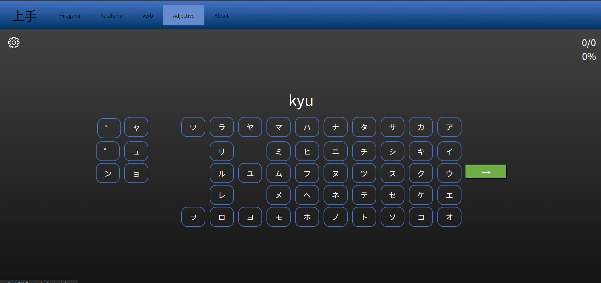
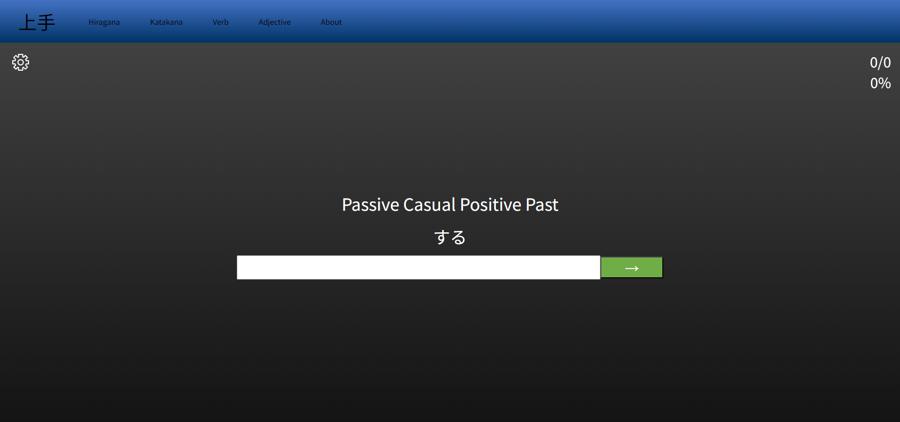
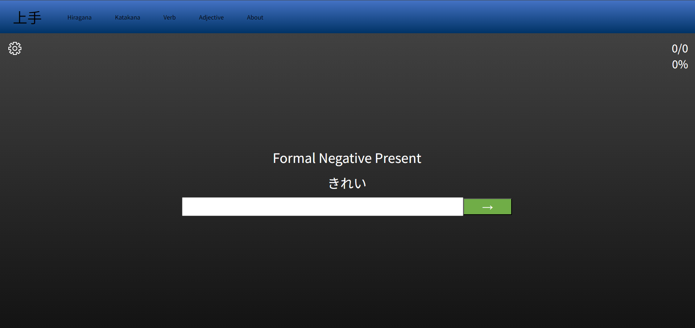

# JouzuJapanese

JouzuJapanese is a web application designed to assist beginner Japanese language students by providing practice activities such as verb and adjective conjugation, as well as practicing
hiragana and katakana.  More practices on the way.

This front-end of this program was written in React, while the back-end is a spring-boot
RESTful API programmed in Java. The back-end is responsible for producing questions for the
front-end, with a significant amount of code related to handling japanese conjugation logic.

Created by: Chase Packer
- packerchase@hotmail.com
- https://github.com/BlueBearon
- https://www.linkedin.com/in/chase-packer/
  
Last Updated: February 13, 2024


# Table of Contents

1. [Requirements](#requirements)
   1. [Frontend (React)](#frontend-react)
   2. [Backend (Java Spring Boot)](#backend-java-spring-boot)

2. [Getting Started](#getting-started)

3. [Features](#features)
   1. [Hiragana Practice](#hiragana-practice)
   2. [Katakana Practice](#katakana-practice)
   3. [Verb Conjugation Practice](#verb-conjugation-practice)
   4. [Adjective Conjugation Practice](#adjective-conjugation-practice)

4. [Typing Japanese Characters](#typing-japanese-characters)
   1. [Windows](#windows)
   2. [Mac](#mac)
   3. [Linux](#linux)

5. [File Structure](#file-structure)

## Requirements

### Frontend (React)

To run the React frontend of JouzuJapanese, you need to have the following software installed:

1. **NodeJS:**
   - Install NodeJS using the following link: [NodeJS Download](https://nodejs.org/en/download)

2. **Visual Studio Tools:**
   - Navigate to the Visual Studio website: [Visual Studio Downloads](https://visualstudio.microsoft.com/downloads/)
   - Download and Install "Build Tools for Visual Studio 2022."
   - In the Visual Studio Tools Application, install "Desktop Development with C++."

### Backend (Java Spring Boot)

To run the Java Spring Boot backend of JouzuJapanese, you need:

- **Maven:**
  - Make sure Maven is installed on your system. If not, you can download and install it from [Maven Apache Download](https://maven.apache.org/download.cgi).

## Getting Started

### Frontend (React)

To set up the React frontend, follow these steps:

1. Clone the repository:

    ```bash
    git clone https://github.com/BlueBearon/JouzuJapanese.git
    ```

2. Navigate to the frontend directory:

    ```bash
    cd frontend/jouzujapanese
    ```

3. Install dependencies:

    ```bash
    npm install
    ```

4. Start the application:

    ```bash
    npm start
    ```

5. Open your web browser and go to `http://localhost:3000/` to view the frontend.

### Backend (Java Spring Boot)

To set up the Java Spring Boot backend, follow these steps:

1. Build and run the backend using Maven:

    ```bash
    mvn spring-boot:run
    ```

2. The backend will be accessible at `http://localhost:8080/`.

## Features

Currently, four type of practices are implemented:

### Hiragana Practice

This practice involves two types of questions:
         
- Hiragana to romaji: Given the Hiragana, type to romaji.

    

- romaji to Hiragana: Given the romaji, use the on-screen keyboard to input the hiragana.

    

### Katakana Practice

This practice involves the same types of questions as Hiragana Practice, but with Katakana instead.





### Verb Conjugation Practice

This practice involves conjugating the given verb with the requested conjugation parameters. 

For Example: 

- する (suru) -> Passive Casual Positive Past -> された (sareta)



### Adjective Conjugation Practice

Similarly, this practice involves conjugating the given adjective with the requested
conjugation parameters.

For Example:

- きれい (kirei) -> Formal Negative Present -> きれいじゃないです

    - **Currently this program requests じゃない not ではない, though this will be addressed in a future update**



# Typing Japanese Characters

**Currently for the Conjugation Practices, the only input they will except is Hiragana.**

Here are the system specific instructions for how to type Japanese characters on your computer.

In a future update, the ability to accept romaji answers may be implemented.

## Windows

### Using Microsoft IME (Input Method Editor)

1. **Enable Microsoft IME:**
   - Go to Control Panel > Clock and Region > Region and Language.
   - In the 'Keyboards and Languages' tab, click on 'Change keyboards...'
   - Add Japanese (Microsoft IME) from the list.

2. **Switch to Japanese Input:**
   - Use `Alt` + `Shift` to toggle between English and Japanese input modes.

3. **Type Hiragana and Katakana:**
   - While in Japanese mode, type in romaji, and Microsoft IME will convert it to hiragana or katakana. Press `Space` to confirm.

4. **Switch to Kanji Input:**
   - Press `F7` to convert hiragana to kanji. Select the desired kanji from the list.

## Mac

### Using Kotoeri Input Method

1. **Enable Kotoeri:**
   - Go to System Preferences > Keyboard > Input Sources.
   - Add 'Japanese' from the list.

2. **Switch to Japanese Input:**
   - Use `Command` + `Space` to toggle between English and Japanese input modes.

3. **Type Hiragana and Katakana:**
   - While in Japanese mode, type in romaji, and Kotoeri will convert it to hiragana or katakana. Press `Enter` to confirm.

4. **Switch to Kanji Input:**
   - Press `Space` to convert hiragana to kanji. Select the desired kanji from the list.

## Linux

### Using IBus-Anthy or Fcitx-Mozc

1. **Install Input Method Framework:**
   - Install IBus or Fcitx as your input method framework. For example, on Ubuntu, you can use:
     ```bash
     sudo apt-get install ibus-anthy
     ```
     or
     ```bash
     sudo apt-get install fcitx-mozc
     ```

2. **Add Japanese Input Method:**
   - Open the IBus Preferences or Fcitx Configuration tool to add the Japanese input method.

3. **Switch to Japanese Input:**
   - Use the configured hotkey to toggle between English and Japanese input modes.

4. **Type Hiragana and Katakana:**
   - While in Japanese mode, type in romaji, and the input method will convert it to hiragana or katakana.

5. **Switch to Kanji Input:**
   - Depending on the input method, you may need to press a specific key to convert hiragana to kanji.

Now you can use these methods to input Japanese characters on your respective operating system while using JouzuJapanese.


## File Structure

- The front-end code for the React application is located in the following folder:

    ```bash
    cd frontend/jouzujapanese
    ```

    - The actual code files are located in:

        ```bash
        cd src
        ```

- The back-end code is located in the following folder:

    ```bash
    cd src/main/java/com/chasepacker/
    ```

    - Code related to conjugation code is located in:

        ```bash
        cd ConjugationCode
        ```

    - XML files containing the japanese words being used are in:

        ```bash
        cd Words
        ```

        - If you wish to add words to the XML files, return to the root of the repository
        and run the following file. (Python is required)

            ```bash
            python pythonScripts/addWords.py
            ```

        


