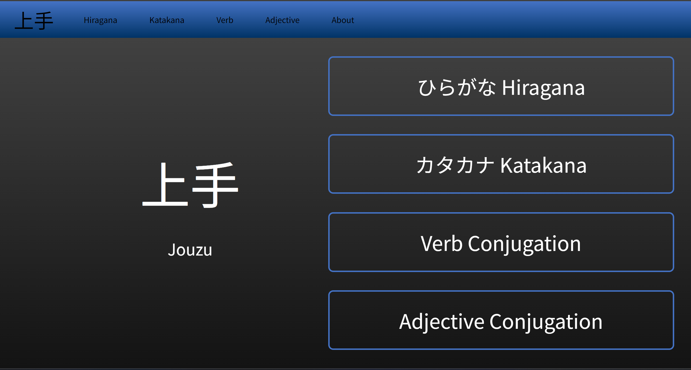
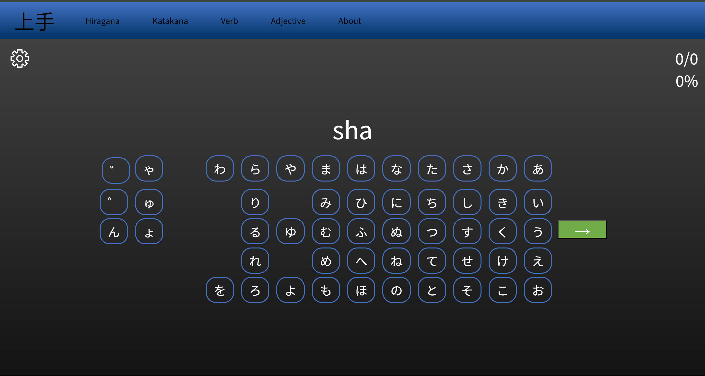
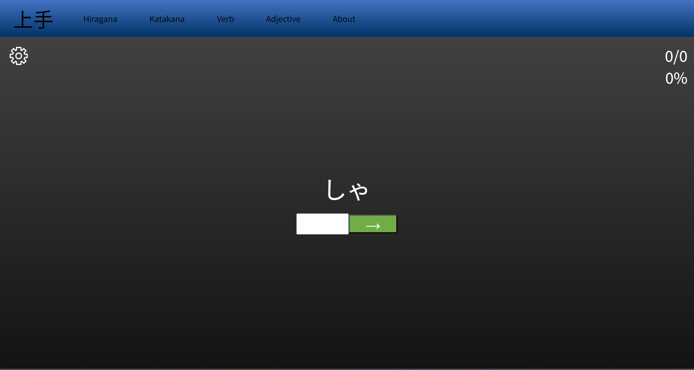

Great, with the provided information, here's an updated README:

# JouzuJapanese

**IN PROGRESS**

More Detailed README coming.

A web application for practicing Japanese language skills.

## Requirements

### Frontend (React)

To run the React frontend of JouzuJapanese, you need to have the following software installed:

1. **NodeJS:**
   - Install NodeJS using the following link: [NodeJS Download](https://nodejs.org/en/download)

2. **Visual Studio Tools:**
   - Navigate to the Visual Studio website: [Visual Studio Downloads](https://visualstudio.microsoft.com/downloads/)
   - Download and Install "Build Tools for Visual Studio 2022."
   - In the Visual Studio Tools Application, install "Desktop Development with C++."

### Backend (Java Spring Boot)

To run the Java Spring Boot backend of JouzuJapanese, you need:

- **Maven:**
  - Make sure Maven is installed on your system. If not, you can download and install it from [Maven Apache Download](https://maven.apache.org/download.cgi).

## Getting Started

### Frontend (React)

To set up the React frontend, follow these steps:

1. Clone the repository:

    ```bash
    git clone https://github.com/BlueBearon/JouzuJapanese.git
    ```

2. Navigate to the frontend directory:

    ```bash
    cd JouzuJapanese/jouzujapanese/frontend/jouzujapanese
    ```

3. Install dependencies:

    ```bash
    npm install
    ```

4. Start the application:

    ```bash
    npm start
    ```

5. Open your web browser and go to `http://localhost:3000/` to view the frontend.

### Backend (Java Spring Boot)

To set up the Java Spring Boot backend, follow these steps:


1. Navigate to the backend directory:

    ```bash
    cd JouzuJapanese/jouzujapanese
    ```

2. Build and run the backend using Maven:

    ```bash
    mvn spring-boot:run
    ```

3. The backend will be accessible at `http://localhost:8080/`.

### Features



Currently, four type of practices are implemented:
    
1. Hiragana Practice





2. Katakana Practice

3. Verb Conjugation Practice

4. Adjective Conjugation Practice


